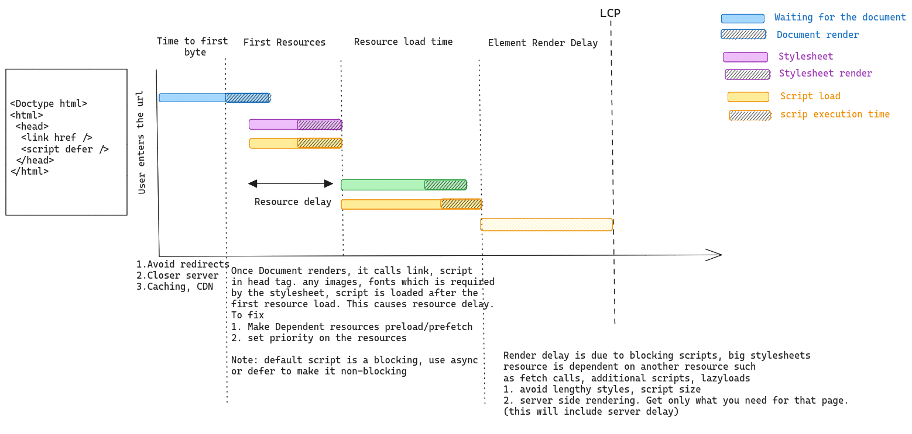

## Web Vitals

Focusses on 3 things
1. Fast loading - Largest Contentful Painting. Page having all the Elements rendered
2. Interactivity - Firts Input Delay. Quickly allow user to interact with the page
3. Visual Stability - Avoid layout shifting, while rendering actions


## LCP 



### Time to first Byte
1. Avoid redirects
2. Closer server
3. Caching, CDN

### Resource load delay
Once Document renders, it calls link, script
in head tag. any images, fonts which is required
by the stylesheet, script is loaded after the 
first resource load. This causes resource delay. 
To fix
1. Make Dependent resources preload/prefetch
2. set priority on the resources
3. Have assets on the same domain

> Note: default script is a blocking, use async
> or defer to make it non-blocking 

### Element Render Delay
Render delay is due to blocking scripts, big stylesheets 
resource is dependent on another resource such 
as fetch calls, additional scripts, lazyloads
1. avoid lengthy styles, script size
2. server side rendering. Get only what you need for that page.
(this will include server delay)

##  FID 
- Avoid huge script files
- Bundle splitting, lazyload

## CLS 
- Have fixed dimensions for elements. 
- Hide/show should not change layout


## Types of measurement
### Field meaurement
Measure web vitals on a live site. using RUM tools like web-vitals + google analytics.

### Lab measurement 
Measure web vitals during development time. Lighthouse is used to ensure the changes dont bring the score down.

> Note: Lab score and Field score may not be the same. but it will tell the improvement areas which we should focus

```
npm install lighthouse
lighthouse http://localhost
```
